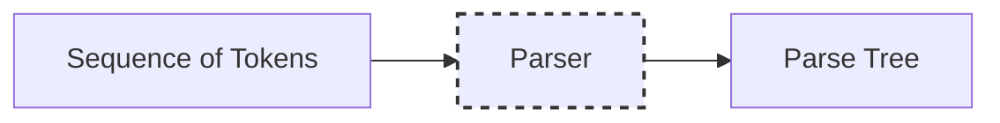
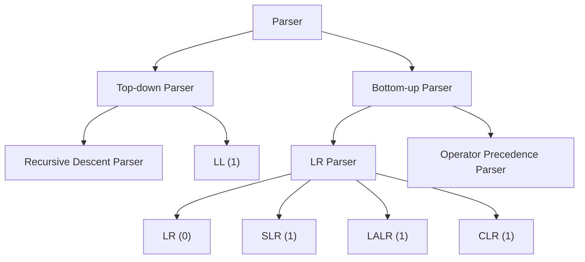
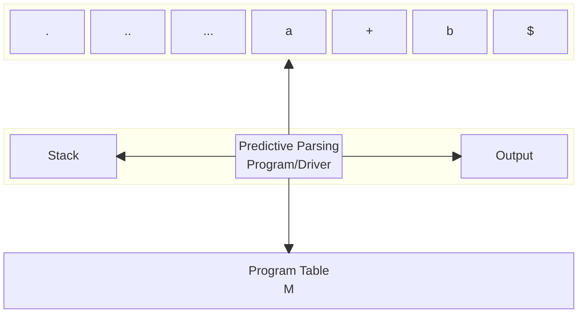

# Types of Parsers in Compiler Design
Jivan Parajuli
<br/>
Roll: 17


---

# Introduction to Parsing
<v-clicks>

- Parsing involves breaking down the input into a hierarchical structure that can be easily interpreted by a computer.

<v-click at="2">

- Parser is a compiler that is used to break the data into smaller elements coming from lexical analysis phase.

</v-click>


- The parser is also known as **Syntax Analyzer**. 

</v-clicks>

---

# Introduction to Parsing


<v-clicks>

Example

````md magic-move

```js
// Source Code:

int a = 5;
```

```js
// After Lexical analysis:

<id, int> <id, a> <=> <5> <id, ;>
```

```js
// After Syntax analysis:

    Declaration
        |
     ___|____________________________________
     |      |    |            |             |
     Type   ID   Assignment   Expression    Semicolon
     |                             |
     int                           Integer Literal


```
             Expression
                 |
              ___|___
             |       |
     IntegerLiteral  Semicolon
         |
         5

````
</v-clicks>

---

# Types of Parser



---

# Top-down Parser

<v-clicks>

- It generates parse for the given input string with the help of grammar productions by expanding the non-terminals i.e. it starts from the start symbol and ends on the terminals.

- It constructs parse tree for the input string, starting from the root and creating the nodes of the parse tree in preorder.

- Equivalently, top-down parsing can be viewed as finding a leftmost derivation for an input string.

</v-clicks>

---

# Top-down parser

Example:

<Transform :scale="1.5">
id+id*id
</Transform>

Grammar:

$$
\begin{align*}
    & E \rightarrow T E' \\
    & E' \rightarrow + T E' \,|\, \varepsilon \\
    & T \rightarrow F T' \\
    & T' \rightarrow * F T' \,|\, \varepsilon \\
    & F \rightarrow ( E ) \,|\, \text{id}
\end{align*}
$$

---

# Top-Down Parser
<style>
 {
  code {
    --uno: bg-slate-500 dark:bg-slate-600;
  }
}
</style>

Grammar: `E -> T E'`, `E' -> + T E' | ε`, `T -> F T'`, `T' -> * F T' | ε`, `F -> ( E ) | id`


<Transform :scale="1.4">

````md magic-move

```js
             E
```


```js
             E
           /  \
          /    \
         T      E'
```


```js
             E
           /  \
          /    \
         T      E'
        /\        
       F  T'  
```

```js
             E
           /  \
          /    \
         T      E'
        /\        
       F  T'  
       |    
      id     
```

```js
             E
           /  \
          /    \
         T      E'
        /\        
       F  T'  
       |  |  
      id  Ɛ   
```

```js
             E
           /  \
          /    \
         T      E'
        /\     /| \   
       F  T'  / |  \
       |  |  +  T   E'
      id  Ɛ   
```

```js
             E
           /  \
          /    \
         T      E'
        /\     /| \   
       F  T'  / |  \
       |  |  +  T   E'
      id  Ɛ    / \   
              /   \    
             F     T'
```

```js
             E
           /  \
          /    \
         T      E'
        /\     /| \   
       F  T'  / |  \
       |  |  +  T   E'
      id  Ɛ    / \   
              /   \    
             F     T'
            /    
           id    
```

```js
             E
           /  \
          /    \
         T      E'
        /\     /| \   
       F  T'  / |  \
       |  |  +  T   E'
      id  Ɛ    / \   
              /   \    
             F     T'
            /     /|\
           id    * F T'
```

```js
             E
           /  \
          /    \
         T      E'
        /\     /| \   
       F  T'  / |  \
       |  |  +  T   E'
      id  Ɛ    / \   
              /   \    
             F     T'
            /     /|\
           id    * F T'
                   |  
                   id  
```

```js
             E
           /  \
          /    \
         T      E'
        /\     /| \   
       F  T'  / |  \
       |  |  +  T   E'
      id  Ɛ    / \   
              /   \    
             F     T'
            /     /|\
           id    * F T'
                   |  \
                   id  Ɛ
```

```js
             E
           /  \
          /    \
         T      E'
        /\     /| \   
       F  T'  / |  \
       |  |  +  T   E'
      id  Ɛ    / \   \
              /   \   Ɛ 
             F     T'
            /     /|\
           id    * F T'
                   |  \
                   id  Ɛ
```
````

</Transform>

---

# Top-Down Parser
## Recursive Descent Parser

<v-click>

- It is also known as the Brute force parser or the backtracking parser. 

</v-click>

<v-click>

- It basically generates the parse tree by using brute force and backtracking. 

</v-click>


<Transform :scale="1.4">

```c {hide|all|2|3|4-5|6-7|8-9|all}{lines:true}
void A(){ 
     Choose an A-production, A -> X1 X2 ... Xk;
     for ( i = 1 to k ) {
        if ( Xi is a nonterminal )
            call procedure Xi();
        else if ( Xi equals the current input symbol A)
            advance the input to the next symbol;
        else
            /* an error has occurred */;
    }
}
```
</Transform>

---

## Recursive Descent Parser
<style>
    code {
        --uno: bg-gray-500 dark:bg-gray-800;
    }

    .slidev-vclick-hidden {
        opacity: 0;
        display: none;
        pointer-events: none;
  }
</style>
Example, Input: `abc` and grammar: $\,\text{S} \rightarrow aBc \, , \, B \rightarrow bc\, |\, b$


<table style="table-layout:fixed;">
<thead class="font-bold text-slate-500">
    <tr>
    <td>Input</td>
    <td>Output</td>
    <td>Rule Used</td>
    </tr>
</thead>
<tbody>
    <tr v-click>
        <td>abc</td>
        <td>S</td>
        <td>S -> aBc</td>
    </tr>
    <tr v-click>
        <td>abc</td>
        <td>aBc</td>
        <td>Match symbol a</td>
    </tr>
    <tr v-click="[3, 8]">
        <td>bc</td>
        <td>Bc</td>
        <td>B -> bc</td>
    </tr>
    <tr v-click="[4, 7]">
        <td>bc</td>
        <td>bcc</td>
        <td>Match symbol b</td>
    </tr>
    <tr v-click="[5, 7]">
        <td>c</td>
        <td>cc</td>
        <td>Match symbol c</td>
    </tr>
    <tr v-click="[6, 7]">
        <td>Φ</td>
        <td>c</td>
        <td>Dead end, backtrack</td>
    </tr>
    <Arrow v-click="[6,8]" x1="920" y1="315" x2="820" y2="315" />
    <tr v-click='8'>
        <td>bc</td>
        <td>Bc</td>
        <td>B -> b</td>
    </tr>
    <tr v-click='9'>
        <td>bc</td>
        <td>bc</td>
        <td>Match symbol b</td>
    </tr>
    <tr v-click='10'>
        <td>c</td>
        <td>c</td>
        <td>Match symbol c</td>
    </tr>
    <tr v-click='11'>
        <td>Φ</td>
        <td>Φ</td>
        <td>Accept input</td>
    </tr>
</tbody>
</table>


---

# Top-Down Parser
## Non-Recursive Descent Parser

<v-clicks>

- LL(1) parser is also known as Non-recursive descent parser or predictive parser or without backtracking parser or dynamic parser.
-  It uses a parsing table to generate the parse tree instead of backtracking.
- LL(1) means:
    - L: scans the input from left to right
    - L: produces a leftmost derivation
    - 1: one input symbol of lookahead at each step to make parsing action decisions

</v-clicks>

---

## Non-Recursive Descent Parser



---

# Bottom-Up Parsing

<v-clicks>

- It generates the parse tree for the given input string with the help of grammar productions by compressing the terminals.
- It starts from terminals and ends on the start symbol.
- It uses the reverse of the rightmost derivation. 
- Construction of a parse tree for an input string beginning at the leaves (the bottom) and working up towards the root (the top).
- Process of **reducing** a string _w_ to the start symbol of the grammar.
- Key decision during parsing are about when to reduce and about what production to apply, as the parse proceeds.

</v-clicks>

---

# Bottom-Up Parser
<style>
 {
  code {
    --uno: bg-gray-500 dark:bg-gray-800;
  }
}
</style>
Example

Grammar: `E -> T E'`, `E' -> + T E' | ε`, `T -> F T'`, `T' -> · F T' | ε`, `F -> ( E ) | id`

<Transform :scale="1.5">

````md magic-move

```js
    id*id
```

```js
    F * id
    |
    id
```

```js
    T * id
    |
    F
    |
    id
```

```js
    T * F 
    |   |
    F   id
    |
    id
```

```js
      T
    / | \
    T * F 
    |   |
    F   id
    |
    id
```

```js
      E
      |
      T
    / | \
    T * F 
    |   |
    F   id
    |
    id
```

````

</Transform>

---

# Bottom-Up Parser
## Shift-Reduce Parsing

- A shift reduce parser tries to reduce the given input string into the starting symbol.
- At each step, a substring matching right side of production rule is replaced by non-terminal at the left side of production rule.

### Stack Implementation

1. Shift: Move symbols fro input buffer onto stack.
2. Reduce: If handle appears, reduce it to corresponding Non-terminal.
3. Accept: If stack is empty when input buffer is empty, accept ie. parsing is done.
4. Error: Parser can't shift, reduce or accept.

<br/>

> Shift/Reduce or Reduce/Reduce conflicts may occur.

---

# Bottom-Up Parser
## LR Parser
- LR parser is the bottom-up parser that generates the parse tree for the given string by using unambiguous grammar.
- It follows the reverse of the rightmost derivation. 
- LR(k) means:
    - L: scans the input from left to right
    - R: constructs right most derivation in reverse
    - k: no of symbols for lookahead
